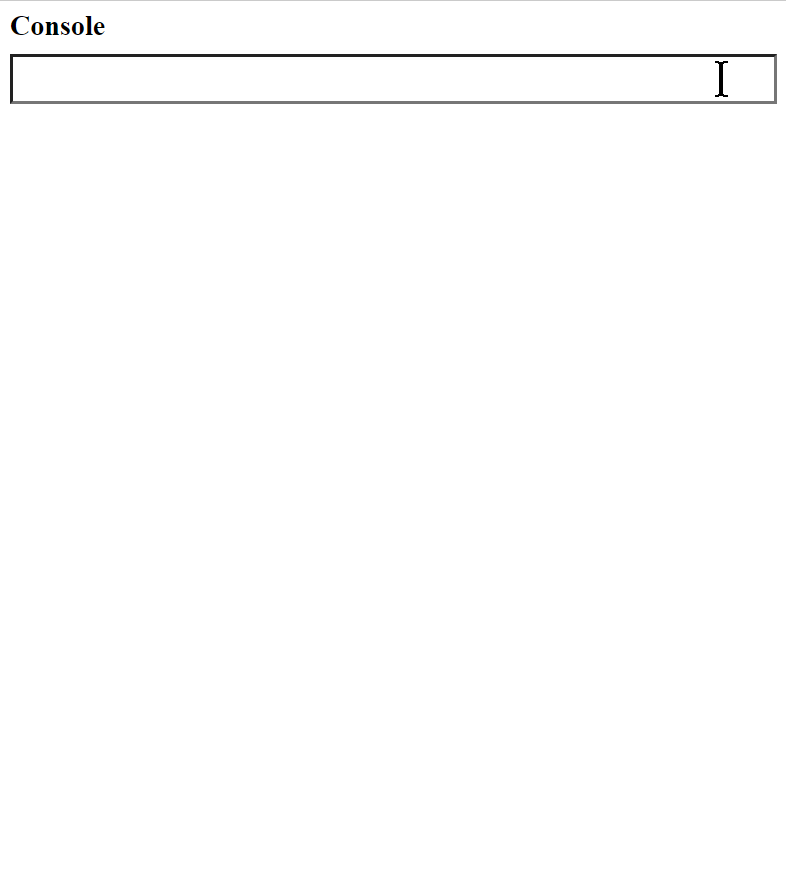

# MiniConsole.JS

v1.5

A lightweight Javascript console for logging errors, inspecting objects, and trying out code snippets on browsers such as iOS that don't have an easily accessible set of developer tools.

## Features

* Ability to run code snippets and inspect the results

* Captures all calls to `console.log()`, `console.warn()`, `console.error()` from other `
       
   The location of the `<script>` tag will determine where on your page the console will be located. You currently need to place this tag *prior* to any other JS code that might trigger errors that you want logged.
     
2. [Download console.js](https://github.com/SimonEast/MiniConsoleJS/raw/main/console.js) and include it in your local project

MiniConsole is not currently published on npm, but it may be in future if the need arises, or if there's enough demand.

You should ONLY use this during development, and should remove the `<script>` tag on production. If you have a dynamic back-end you could only include the script *ONLY* when you have `?debug` at the end of the URL, or something like that, to avoid accidentally deploying it to production.

## Known Issues

* It would be nice to place the `<script>` tag in the header and have the console display somewhere else on the page. That functionality hasn't been written yet.

* You CANNOT inspect HTML elements and CSS properties by point and click, like you can on other developer tools. This is focused on being a Javascript console only.

* It's a bit rough and not thoroughly browser tested, but it seems to do the job.

* Unlike Chrome dev tools, you cannot inspect circular references, where objects refer to themselves. It currently produces an error.

* It would be nice to be able to toggle the console open and closed. That functionality doesn't exist yet.

## Similar Projects

* https://github.com/liriliri/eruda - much more advanced version
* https://www.npmjs.com/package/vconsole - another similar console
* http://www.bagnall.co.uk/free_stuff/console/ - simple error log that shows in floating window that can be moved around
* https://inspect.dev/ - commercial product with free 14 day trial
* https://github.com/voidfiles/Node.js-Remote-Console.log - this pipes log errors from your device through to a remote PC running this NodeJS script

## Bugs and Pull Requests

I won't be spending a lot of time or attention on this script, but feel free to [submit bug reports](https://github.com/SimonEast/MiniConsoleJS/issues) and pull requests if you'd like to make an improvement. Feedback welcome.

## Licence

GNU General Public License v3.0
